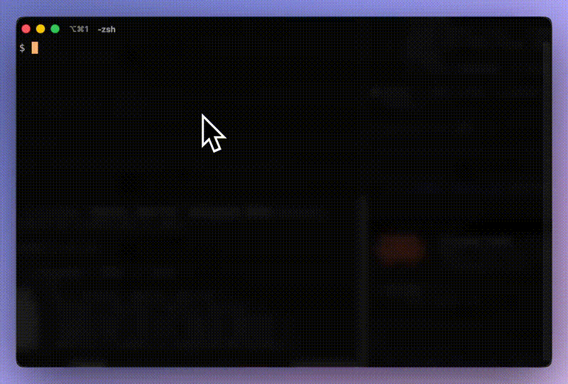

# herm

Terminal-native AI coding agent running in containers.



## Features

- Interactive chat with LLM agents via [langdag](https://langdag.com)
- Docker container integration for sandboxed code execution
- Git worktree management
- Markdown rendering in the terminal
- Configurable models, skills, and system prompts
- Conversation history and scratchpad

## Build

Requires Go 1.25+.

```sh
go build -o herm ./cmd/herm
```

Additional commands:

```sh
go build ./cmd/simple-chat   # minimal chat client
go build ./cmd/debug          # debug utilities
```

## Run

```sh
./herm
```

## Test

```sh
go test ./...
```

## Project Structure

```
cmd/herm/         Main application source (package main)
cmd/herm/prompts/ System prompt templates (embedded)
cmd/herm/dockerfiles/ Dockerfiles for container support (embedded)
cmd/simple-chat/  Minimal chat client
cmd/debug/        Debug utilities
plans/            Project planning docs
```

## License

[MIT](LICENSE)
